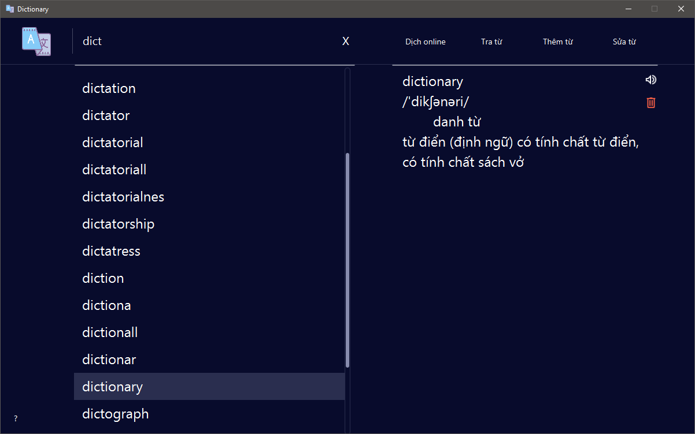

# EVDictionary-Java
English-Vietnamese Dictionary with Online Google Translate

Các thành viên trong nhóm UET K64-K2:
- Hoàng Hải Nam
- Đinh Ngọc Sơn
- Nguyễn Tiến Nghĩa

Phiên bản sử dụng: JDK 17

Framework: SceneBuilder, JavaFX

Technology: MySQL, JDBC, FreeTTS, REST

## Mô tả chức năng

- Từ điển tuân theo mô hình CRUD với các chức năng sau:

 Tra từ tiếng Anh, hiển thị cách phát âm, loại từ và nghĩa trong tiếng Việt

 Thêm từ mới hoặc xóa từ trong tiếng Anh

 Cho phép cập nhật (hay sửa) loại từ và nghĩa trong tiếng Anh

 Phát âm từ tiếng Anh (English US)

 Dịch câu tiếng Anh sang tiếng Việt sử dụng Google Translate API (giới hạn 1024 ký tự)

- Hướng phát triển tiếp theo: Thêm ngôn ngữ dịch, tích hợp cho website, dịch file, dịch ảnh.
